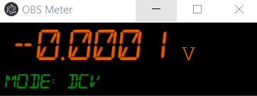

# OBS-Meter

A feature complete VICI VC8145 Digital Multimeter application for displaying output in a window on Windows/Linux/MacOS.



## Development

To clone and run this repository you'll need [Git](https://git-scm.com) and [nvm](https://github.com/nvm-sh/nvm) installed on your computer. From your command line:

```bash
# Clone this repository
git clone git@github.com:DanielHaroldLane/OBS-Meter.git
# Go into the repository
cd OBS-Meter
# Install pre-requisite node version
nvm install v14.17.3
# Use the required node version
nvm use
# Install the yarn package manager
npm install yarn -g
# Install required libraries
yarn
# Run the app
yarn start
```

## Building the Project

```bash
# Clone this repository
git clone git@github.com:DanielHaroldLane/OBS-Meter.git
# Go into the repository
cd OBS-Meter
# Install pre-requisite node version
nvm install v14.17.3
# Use the required node version
nvm use
# Install the yarn package manager
npm install yarn -g
# Install required libraries
yarn
# Run the app
yarn dist
```
